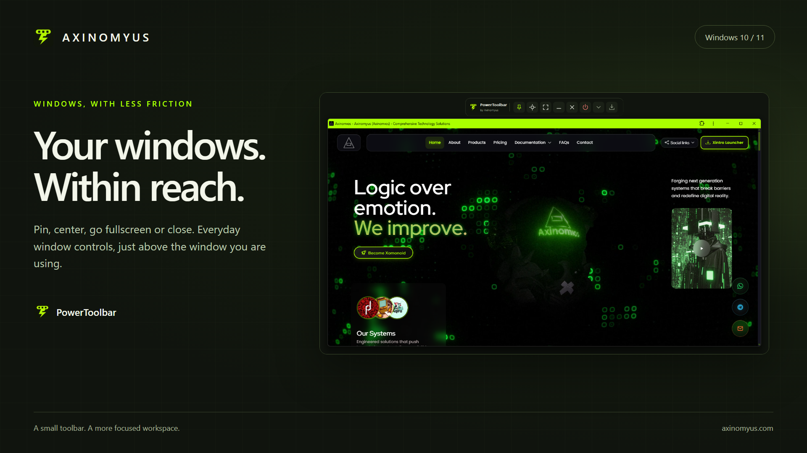
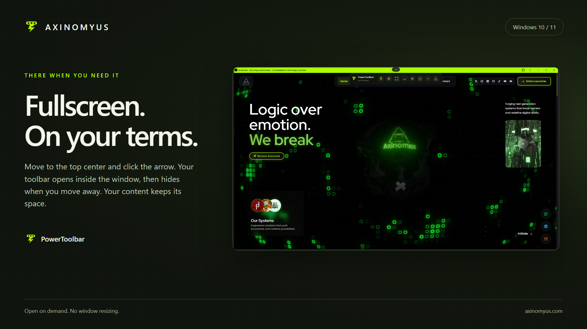

# PowerToolbar

Everyday Windows controls just above your active window. Built by [Axinomyus](https://www.axinomyus.com/products/powertoolbar), with a charcoal and lime interface, a compact mode and a configurable toolbar.



## Controls

Pin, center, enter fullscreen, minimize or close the selected window. Ending an app requires confirmation and affects processes running the same executable. Windows Explorer is protected from this action.

The toolbar normally stays outside the window. It hides for maximized/fullscreen windows and whenever there is insufficient space above a normal window. In a maximized/fullscreen window, pause the pointer at the monitor's top center: a small down arrow appears. Click it to open your toolbar inside the window; click the up arrow or move away to collapse it. The window is never resized to make room. You can also use **Leave window fullscreen** in the tray menu to restore a window made fullscreen by PowerToolbar.

**Hide to tray** stays hidden across foreground changes and disables the top-center reveal. Restore it by double-clicking the tray icon, choosing **Open PowerToolbar**, or launching PowerToolbar again. **Exit** ends the application.



## Settings

Click the PowerToolbar name or choose Settings from the tray/right-click menu.

- Show, hide and reorder individual buttons; reset to the default layout.
- Choose English, Turkish, German, Ukrainian or Russian for the panel, menus and tooltips.
- Enable or disable startup with Windows and choose whether to start hidden in the tray.
- Open the About page and product website.
- Add **Mute / unmute app** or **Capture window content**. Both are hidden by default.

The audio button controls the selected app's Windows audio sessions, including its child processes. A crossed-out speaker indicates that all matching sessions are muted; the state follows external changes and window selection. Windows belonging to the same process share audio. System volume is unchanged. An app must have an audio session for this control to work.

Capture saves the visible client area to a user-selected PNG, without the window frame or toolbar. The fullscreen toolbar and reveal arrow are hidden before capture. Keep the whole window on screen and unobscured. It captures visible pixels, not scrolled-off content; protected content may be blank. Canceling the save dialog writes no image.

Settings are stored locally under `HKCU\Software\Axinomyus\PowerToolbar`. No account, telemetry or network service is required. Opening the website uses the default browser.

## Build and run

Windows 10 version 1607 or later; Windows 11. The packaged build is x64. Build with Visual Studio 2022 or newer, Desktop development with C++, and the Windows 10/11 SDK.

Open `PowerToolbar/PowerToolbar.sln`, choose **Release / x64**, and build. The default project toolset is VS 2022 v143; with a newer Visual Studio, select its installed C++ toolset when prompted. You can also build from a Visual Studio Developer PowerShell:

```powershell
msbuild PowerToolbar/PowerToolbar.sln /m /p:Configuration=Release /p:Platform=x64
.\build\x64\Release\PowerToolbar.exe
```

The application uses the static C++ runtime and needs no Python or other third-party runtime. Normal use does not need administrator rights; Windows may restrict operations on elevated/protected applications.

## Repository contents

This repository contains the application source, Visual Studio solution, application/tray icons, license, and only the images referenced in this README. Installer recipes, built executables, test harnesses, internal documentation and Store/website publication assets are maintained separately.

Version **1.1.0** is prepared for distribution through [GitHub Releases](https://github.com/Axinomyus/windows-toolbar/releases). The installer and portable ZIP are unsigned; Windows may display an unknown-publisher or SmartScreen warning. Locally prepared packages are not necessarily published there yet. Installers and portable packages are maintained outside the source tree.

The local desktop checks cover hide/restore, fullscreen reveal, window targeting, translations, saved settings, app audio isolation and mute icons, client-area PNG capture, startup registration and resource stability. Installation, upgrade and uninstall have not been executed for this build; it is prepared as a pre-release. Actual Windows restart/login, clean-machine installation and physical mixed-DPI monitors require separate validation.

The solution, project, resources and executable are named PowerToolbar. The existing GitHub repository URL remains [Axinomyus/windows-toolbar](https://github.com/Axinomyus/windows-toolbar); renaming the remote repository is a separate hosting operation.

## License

[MIT](LICENSE) · Axinomyus
